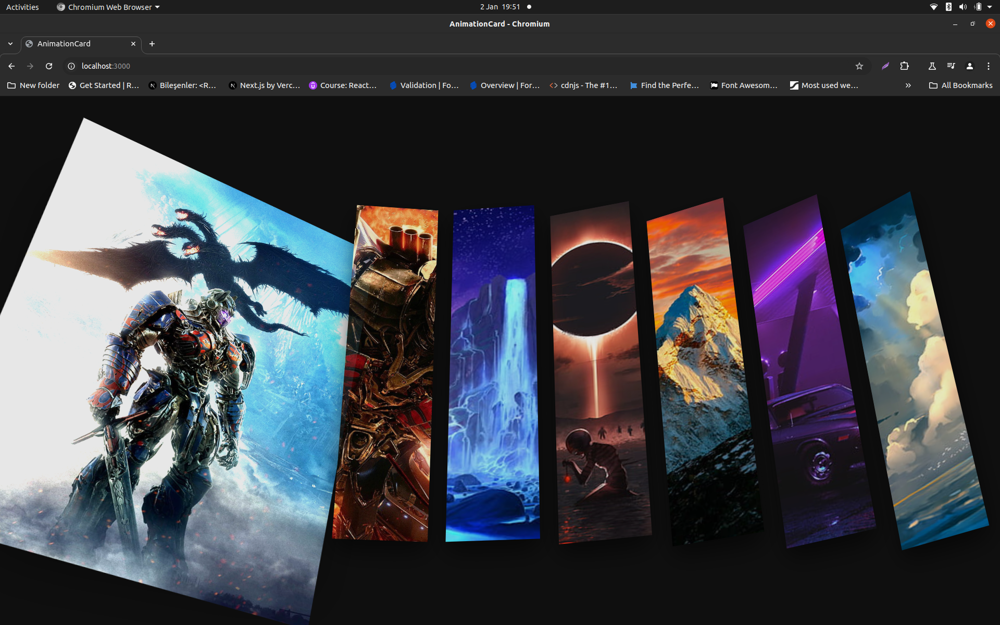
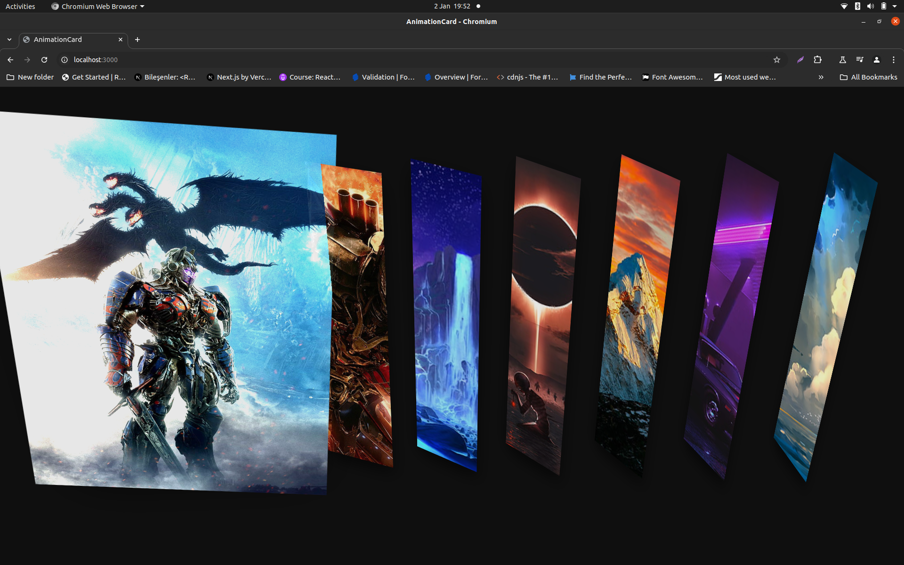
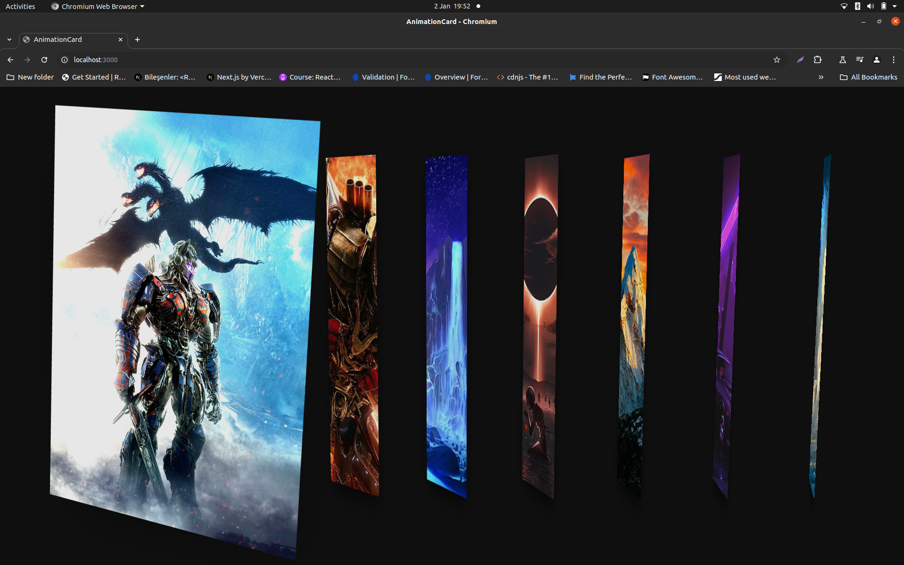
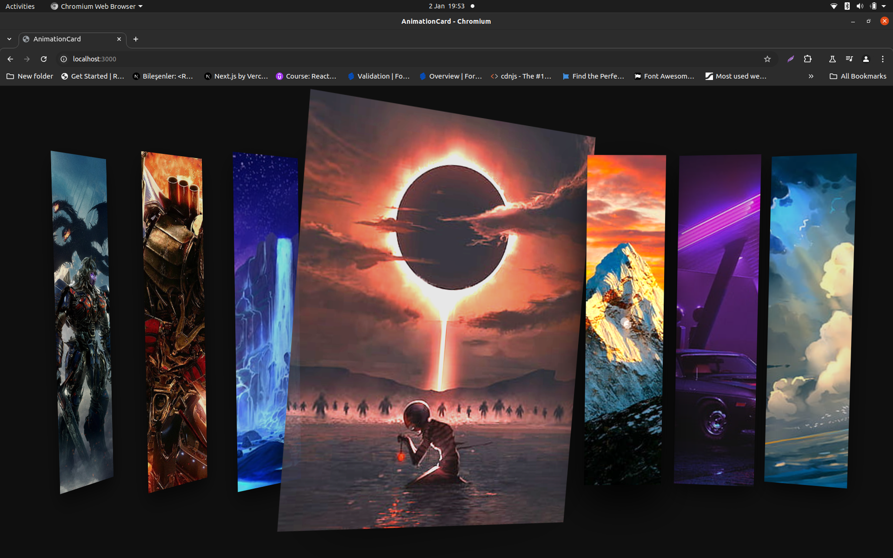

Web Animation Card Project
Bu proje, etkileşimli animasyonlar ve görsel efektlerle donatılmış bir kart tasarımını içeriyor. Kullanıcılar, üzerine geldiklerinde ve tıkladıklarında kartların animasyonlarla genişlediğini görecekler.

Görüntüler:

Teknolojiler
Bu proje aşağıdaki teknolojileri kullanmaktadır:

HTML5
CSS3
JavaScript (ES6)
Katkıda Bulunma
Bu projeye katkıda bulunmak için şu adımları izleyebilirsiniz:

Bu projeyi forklayın.
Yeni bir özellik ekleyin veya hata düzeltmeleri yapın.
Pull request gönderin.

Lisans
Bu proje MIT Lisansı altında lisanslanmıştır.

# animationcard
